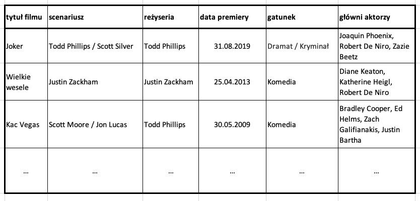

# Normalizacja baz danych

W tym krótkim materiale uzupełniającym wykład skupimy się nad zagadnieniem
normalizacji zbiorów danych. Można by powiedzieć, że normalizacja zbioru danych 
orzeka o podobnych rzeczach co zdrowość sposobu gromadzenia przez nią danych. 
Im wyższa postać normalna jest dla danego zbioru zdefiniowana, tym gromadzenie 
w ten sposób danych uodparnia cały system na problem utraty spójności (zdrowia) systemu.

Przypomnijmy zasady dotyczące poszczególnych postaci normalnych:

## 1NF - pierwsza postać normalna

Według zasady tej dane muszą być gromadzone w systemie w sposób możliwie najdrobniejszy

* pojedyncze wiersze nie mogą gromadzić danych o więcej niż jednym obiekcie/encji (zależność od klucza),
* innym wyrażeniem powyższego jest to, że każda encja jest opisana unikatowym kluczem,
* pojedyncze kolumny nie mogą zawierać wartości które są podzielne (atomowość wartości),
* kolejność wierszy nie może zmieniać ich znaczenia.

W celu zlokalizowania tego problemu w danych poszukujemy miejsc, 
gdzie w komórce (wiersz + kolumna) znajdują się grupy lub listy informacji to 
możemy podejrzewać naruszenie tej zasady.

Jeśli mamy w kolumnie listę Np. że `dany wiersz zna (tu lista osób)` to podejrzewamy, 
że tak naprawdę trzeba by utworzyć wiele wierszy aby poprawnie opisać te zależnośći.

Podobnie zauważmy, że jeśli np. w bazie składowany jest cały adres w jednym polu, to
gromadzona informacja jest podzielna. Można ją podzielić na miasto , ulicę, numer domu , etc.

Kolejnym przykładem byłoby gdy rolę odgrywała kolejność. Jeśli np. składowalibyśmy w systemi dane
o logowaniach telefonu danej osoby. I chcąc ustalić gdzie jest w danej chwili - musieli wziąć ostatni 
rekord o niej z bazy ... to zmiana sortowania tych danych - powododuje, że tracimy dostęp do tej informacji.

Jak radzimy sobie z problemami z 1NF - dzieląc wiersze na wiecej wierszy, kolumny na więcej kolumn.

### Zależność funkcyjna

Czasem mówimy o 1NF jako zasadzie orzekającej, że atrybuty niekluczowe są w 
zależności funkcyjnej od klucza. Przez zależność fukcyjną mamy na myśli, że
dla danego układu wartości klucza może istnieć tylko jedna encja ją posiadająca.

## 2NF - druga postać normalna

Według tej zasady klucze nie powinny być niepotrzebnie duże.

Rozważmy sobie sytuacje gdzie $A_1, A_2,... , A_k$ są atrybutami kluczowymi oraz $B_1, ... , B_m$ 
atrybutami niekluczowymi (innymi). Wiemy, że klucz jednoznacznie opisuje wszystkie atrybuty niekluczowe.
Zależy nam aby ta _zależność funkcyjna_ była _pełną zależnością funkcyjną_. Rozumiemy przez to, że 
brak pewnego atrybutu kluczowe pozbawia nas jednoznaczności dla pewnej(pewnych) atrybutów niekluczowych. 

Da się to wyrazić prostą zasadą:

__Żaden mniejszy klucz nie opisałby dobrze żadnej kolumny__

Oznacza to, że usunięcie z klucza dowolnej z kolumn $A_1,...,A_k$ sprawia, że nie umiemy określić wartości 
w dowolnej z kolumn $B_1, ... , B_m$ 

W praktyce najczęściej rozwiązywane jest to poprzez budowanie minimalnych i autogenerowanych kluczy głównych.
Czasami jest to jednak rozwiązywane poprzez wydzielenie do osobnej tabeli zależnośći opisywanej przez mniejszy
klucz.

## 3NF - trzecia postać normalna

Rozszerzeniem koncepcji z 2NF jest 3NF. Tak jak w 2NF poszukiwaliśmy zależności funkcyjnych 
od mniejszego klucza, tu
poszukujemy ich pomiędzy wszelkimi pozostałymi kolumnami.

Przykładem tu mógłaby być data urodzenia i pesel. Choć oba nie byłyby traktowane jako część klucza 
głównego, zauważmy, że (przy założeniu poprawności) znająć pesel możemy podać datę urodzenia danej osoby.

3 postać normalną osiągamy poprzez wydzielenie zależności funkcyjnej do osobnej tabeli.

# Zadanie przykładowe

## Zadanie 1

Omów postać tego zbioru danych, oraz czynności jakie należałoby wykonać aby zapewnić 
mu jak najlepszą postać normalną.

## Zadanie 2

| ID_zamówienia |  Kod_produktu | Nazwa_produktu                                                                   | ID_klienta| Dane osobowe|
| --- | --- |----------------------------------------------------------------------------------| --- | --- |
| 1 |  M24c | Monitor Arka7 24’                                                                |  21 | Sebastian Jolarek, Gdynia, ul. Krabowa 3|
| 2 | Mikro_32| Mikrofala Astra 2                                                                | 3 | Kazimierz Wielki, Gdańsk, Ul. Bartolomea 1|
| 3 | Mikro_32|  Mikrofala Astra 2                                                               | 5                                                                                | Bartosz Król, Kraków, ul. Paluszyńska 3 |
| 4 | TV_50Plasm | Telewizor Orwell 1984, 50’ | 8 | Mariola Maciaszczyk, Dąbrówka Wielka, ul. Główna 12 | 
| 5 | M32c |  Monitor ULTRAHD 32’ | 21  | Sebastian Jolarek, Gdynia, ul. Krabowa 3 |

1. Jakie problemy możemy napotkać przy dodawaniu nowych
informacji do bazy danych? Co z usuwaniem?
1. Czy możemy uznać, że baza spełnia postulaty 1NF? Zaproponuj
ewentualną modyfikację.
1. Czy baza spełnia postulaty 2NF? Uzasadnij odpowiedź i
zaproponuj ewentualne rozwiązanie tego problemu.
1. Czy po wprowadzonych modyfikacjach baza spełnia postulaty
3NF? Jeżeli nie, wprowadź stosowne modyfikacje do
poprzedniego rozwiązania.

## Zadanie 3

Dokonaj normalizacji bazy danych zadanej w następujący sposób:

| Nr albumu | Imię i nazwisko | Email | Przedmioty kursowe | Oceny |
| ---       | ---             | ---   | ---                | ---   |
| 100111 | Jacek Kaczmarski | 100111@edu.p.lodz.pl|  MD204 (Matematyka Dyskretna), SI204 (Sztuczna Inteligencja), IT221 (Technologie Informacyjne) | 3,3.5,3 |
| 898989 | Krzysztof Marchewa | 898989@edu.p.lodz.pl|  TO223 (Teoria Operatorów), SE301 (Systemy Ekspertowe) | 4,4.5 |
| 123321 | Barbara Tomaszewska | 123321@edu.p.lodz.pl|  SI204 (Sztuczna Inteligencja) | 5 |
| 121212 | Milena Mroczek |  121212@edu.p.lodz.pl | MD204 (Matematyka Dyskretna), SI204 (Sztuczna Inteligencja), IT221 (Technologie Informacyjne) |4,2,5 |