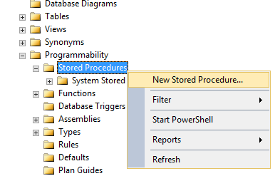
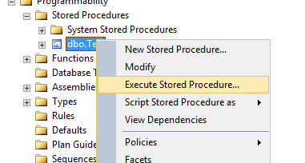

# Procedury składowane

Procedury składowane są blokami programowalnymi języka T-SQL mającym za zadanie realizacje danego - atomowego zadania. 
Pozwalają na komponowanie i wywoływanie kilku komend języka SQL. Służy z reguły do przeprowadzania złożonych operacji na danych.

## Wskazówka

Jeśli aby zrealizować jakieś zadanie konieczne jest użycie dwóch różnych operacji SQL - to sensownym jest 
rozważenie utworzenia odpowiedniej procedury

# Tworzenie nowej procedury w SSMS

Aby utworzyć nową procedurę należy wybrać z menu danej bazy danych w sekcji Programmability katalog Stored Procedures i 
wybrać utworzenie nowej procedury składowanej



Efektem tego jest utworzenie nowego szablonu procedury składowanej postaci

```tsql
-- ================================================
-- Template generated from Template Explorer using:
-- Create Procedure (New Menu).SQL
--
-- Use the Specify Values for Template Parameters 
-- command (Ctrl-Shift-M) to fill in the parameter 
-- values below.
--
-- This block of comments will not be included in
-- the definition of the procedure.
-- ================================================
SET ANSI_NULLS ON
GO
SET QUOTED_IDENTIFIER ON
GO
-- =============================================
-- Author:		<Author,,Name>
-- Create date: <Create Date,,>
-- Description:	<Description,,>
-- =============================================
CREATE PROCEDURE <Procedure_Name, sysname, ProcedureName> 
	-- Add the parameters for the stored procedure here
	<@Param1, sysname, @p1> <Datatype_For_Param1, , int> = <Default_Value_For_Param1, , 0>, 
	<@Param2, sysname, @p2> <Datatype_For_Param2, , int> = <Default_Value_For_Param2, , 0>
AS
BEGIN
	-- SET NOCOUNT ON added to prevent extra result sets from
	-- interfering with SELECT statements.
	SET NOCOUNT ON;

    -- Insert statements for procedure here
	SELECT <@Param1, sysname, @p1>, <@Param2, sysname, @p2>
END
GO
```

Szablon ten należy odpowiednio uzupełnić - jednak aby to zrobić musimi najpierw poznać dokładnie jego strukturę:

## Procedura bezparametrowa

Procedury mogą być wywoływane bezparametrycznie - tzn. nie wymagać żadnych dodatkowych informacji poza tym, że są one 
niezbędne w danej chwili do wywołania


```tsql
CREATE PROCEDURE Test

AS
BEGIN
	SET NOCOUNT ON;
	SELECT nazwa FROM Skladniki where id_skladnik in (
		select id_skladnik from Pizza_z_Menu_vs_Skladniki where id_pizza in (
			select id_pizza from Pizza_z_Menu where nazwa='Margarita'
		)
	);
END
```

Wtedy po utworzeniu, zmodyfikowaniu i zapisaniu procedury (execute) możemy ją podejrzeć i wywołać z sekcji stored procedure



Spowoduje to utworzenie skrypu postaci

```tsql
USE [Procedury]

DECLARE	@return_value int

EXEC	@return_value = [dbo].[Test]

SELECT	'Return Value' = @return_value

```

## Procedura parametryczna

Procedury mogą występować również w postaci parametrycznej tj. 

```tsql
-- =============================================
-- Author:		P. Kowalski
-- Create date: 1 maja 2017
-- Description:	Wykonuje testowy select
-- =============================================
CREATE PROCEDURE Test
	-- Add the parameters for the stored procedure here
	@NazwaPizzy varchar(20) = 'Margarita'
AS
BEGIN
	-- SET NOCOUNT ON added to prevent extra result sets from
	-- interfering with SELECT statements.
	SET NOCOUNT ON;
    -- Insert statements for procedure here
	SELECT nazwa FROM Skladniki where id_skladnik in (
		select id_skladnik from Pizza_z_Menu_vs_Skladniki where id_pizza in (
			select id_pizza from Pizza_z_Menu where nazwa=@NazwaPizzy
		)
	);
END
GO
```

Powyższa procedura posiada jeden parametr nazwany NazwaPizzy o typie varchar(20) z wartością domyślną (jeśli nie jest podana inna) równej 'Margarita'

```tsql
@NazwaPizzy varchar(20) = 'Margarita' 
```

# Programowanie procedur składowanych

## Tworzenie zmiennych 

W T-SQL możliwe jest przekazywanie parametrów jak i definiowane zmiennych we wnętrzu funkcji. Zmienne zwykło się nazywać od znaku małpy mailowej. W taki sam sposób definiujemy również zmienne we wnętrzu bloku kodu

```tsql
DECLARE @zmienna typ; 
```

Przykładem zastosowanie tej instrukcji jest następujący skrypt


```tsql
CREATE PROCEDURE SampleVariable
	
AS
	Declare @sample varchar(10) = 'Testowa';
BEGIN
	-- SET NOCOUNT ON added to prevent extra result sets from
	-- interfering with SELECT statements.
	SET NOCOUNT ON;

	SELECT @sample;
	RETURN 0;
END
```

Do umieszczenia wartości w zmiennej wystarcza z reguły operacja SELECT

```tsql
SELECT @zmienna = wartosc;
-- lub
SELECT @zmienna = kolumna FROM TABELA;
```

Należy kontrolować jednak rozmiar typów. Na użytkowniku spoczywa kontrolowanie typu. Pamiętajmy, że w T-SQL różnice 
w typach są bardzo wyraźnie sygnalizowane i próba przypisaniu varchar(20) do zmiennej typu varchar(19) - 
nawet jeśli nie spowoduje usuniecie znaczących liter będzie sygnalizowane błędem.

Aby skorzystać ze zmiennej w bloku procedury składowanej można posłużyć się przykładem


```tsql
-- =============================================
-- Author:		Piotr Kowalski
-- Create date: 27.03.2018
-- Description:	Przykładem zastosowanie tej instrukcji jest następujący skrypt
-- =============================================
CREATE PROCEDURE SampleVariable
	
AS
	Declare @sample varchar(10) = 'Testowa';
BEGIN
	-- SET NOCOUNT ON added to prevent extra result sets from
	-- interfering with SELECT statements.
	SET NOCOUNT ON;

	SELECT @sample;
	RETURN 0;
END
```

```tsql
exec [dbo].SampleVariable
```


## Typy zwracane

### Instrukcja powrotu

Jeśli procedura ma za zadanie przekazać do dalszego przekształcania wyliczone dane - należy je przekazać na zewnątrz ale nie za pomocą komendy RETURN

```tsql
RETURN @variable
```

Wartość zwracana przez return powinna służyć nam w zupełnie innym celu. Jest to forma prezentacji informacji 
o efekcie działania procedury - innymi słowy zwrócenie wartości innej od 0 
odpowiada sygnałowi oraz załączonemu kodowi błędu.

Do zwracania danych wykorzystujemy typy out o których dalej.

### Zmienne o typie zwracanym

Procedura moze miec parametry o typie OUT czyli zwracanym z
nowa wartoscia. Oznacza to, że przekazana tam zmienna po wykonaniu będzie zaincjowana wartością wynikającą z operacji które zostały wykonane w trakcie działania procedury. Aby określić parametr jako wyjściowy wystarczy zastosować następującą składnię

```tsql
CREATE PROCEDURE ProcedurkaWyjsciowa
-- Add the parameters for the stored procedure here
@ParametrZwracany typ OUTPUT
AS
```

Przykładowym sposobem na zrealizowanie tego wzorca jest poniższe

```tsql
-- =============================================
-- Author:		Piotr Kowalski
-- Create date: 27.03.18
-- Description:	Prezents how to return a data
-- =============================================
CREATE PROCEDURE SampleProcWithOUT
	-- Add the parameters for the stored procedure here
	@result int OUTPUT
AS
BEGIN
	-- SET NOCOUNT ON added to prevent extra result sets from
	-- interfering with SELECT statements.
	SET NOCOUNT ON;
	SELECT @result=4;
	return 0;
END
```

```tsql
DECLARE	@return_value int,
		@result int

EXEC	@return_value = [dbo].[SampleProcWithOUT]
		@result = @result OUTPUT

SELECT	@result as N'@result'

SELECT	'Return Value' = @return_value
```


## Zmienne o typie tablicowym

Czy pamiętamy z wykładu o matematycznym modelu relacyjnym, że każda relacja posiada swój unikatowy typ relacji. Tak więc T-SQL udostępnia nam również typ dla tabeli o określonych składowych - mogący przechowywać dowolną ilość krotek

```tsql
DECLARE @zmienna TABLE (lista kolumn i typow);
INSERT INTO @zmienna SELECT ...
```

## Instrukcje warunkowe T-SQL

Główne korzyści płynące z procedur składowanych wiążą się z wywoływaniem warunkowo różnych kwerend i innych poleceń języka SQL. T-SQL posiada w swojej składni dostępne instrukcje warunkowe jak np.

```tsql
IF (warunek)
BEGIN
...
END
```

Albo wzbogacone o klauzulę ELSE

```tsql
IF (warunek)
BEGIN
...
END
ELSE
BEGIN
...
END
```

Albo z wielokrotnym sprawdzeniem 

```tsql
IF (warunek)
BEGIN
...
END
ELSE IF (warunek2)
BEGIN
...
END
ELSE
BEGIN
...
END

```

Przykładem zastosowanie tej instrukcji jest następujący skrypt


```tsql
-- =============================================
-- Author:		Piotr Kowalski
-- Create date: 27.03.18
-- Description:	PRESENT HOW TO use If
-- =============================================
CREATE PROCEDURE SampleIF
AS
	declare @Ilosc int;
BEGIN
	-- SET NOCOUNT ON added to prevent extra result sets from
	-- interfering with SELECT statements.
	SET NOCOUNT ON;

	SELECT @Ilosc=COUNT(*) FROM Pizza_wlasna;
	IF (@Ilosc > 0)
	BEGIN
		 SELECT * FROM Pizza_wlasna;
	END
	ELSE
	BEGIN
		SELECT * FROM Pizza_z_Menu;
	END
	RETURN 0;
END
```

```tsql
DECLARE	@return_value int

EXEC	@return_value = [dbo].[SampleIF]

SELECT	'Return Value' = @return_value
```


## Instrukcja CASE

Alternatywnie do IF można rozważyć zawsze instrukcję CASE, która służy głównie do szybkiego warunkowego wartościowania

```tsql
CASE
WHEN warunek1 THEN wartosc1
WHEN warunek2 THEN wartosc2
ELSE wartoscDomyslna
END
```


### Instrukcja skoku

T-SQL jako jeden z niewielu język programowania pozwala i zachęca do stosowanie instrukcji skoku (nie rekomenduje jej jednak do tworzenia petli). Składnia tej komendy ma postać:

```tsql
GOTO etykieta
-- jakiś kod tutaj
etykieta:
-- tu kontynuacja
```


Najczęściej składnia skoku GOTO wiążę się z obsługą błędu

```tsql
IF (stan <> 1)
BEGIN
  GOTO Error
END
-- jakies dalsze przetwarzanie
return @wynik
Error:
-- obsluga błędu
```

## Instrukcja WHILE

Naturalnie język T-SQL tak jak większość języków programowalnych posiada instrukcję pętli postaci

```tsql
WHILE (warunek)
BEGIN
...
END
```

Przydatność jednak takiego rozwiązania jest dość ograniczona względem innych języków programowania. W końcu język T-SQL i tak już w sobie posiada wbudowane narzędzia do przetwarzania dużych zbiorów danych.

# Zadania 

## Zadanie 1

Przygotować procedurę dodającą nową książkę do bazy danych. Niech przyjmuje dane autora, nazwę kategorii, wydawnictwa, tytuł
i rok wydania. Procedura powinna sprawdzić czy dana kategoria istnieje, dany autor, dane wydawnictwo.

## Zadanie 2

Zadbać aby zadanie 1 wykonało się jako pojedyncza transakcja

## Zadanie 3

Przygotuj procedurę dodającą nowe wypożyczenie czytelnika rozpoznanego po loginie książki wprowadzaną przez pracownika 
o ustalonym loginie. Zwróć uwagę by użytkownik nie przekroczył ustalonej liczby wypożyczeń 7. Oraz poinformuj pracownika
o liczbie wypożyczonych przez danego użytkownikach obecnie książkach.

## Zadanie 4

Przygotuj procedurę usunięcia konta czytelnika, o ile oczywiście nie posiada on dłużnych książek. 