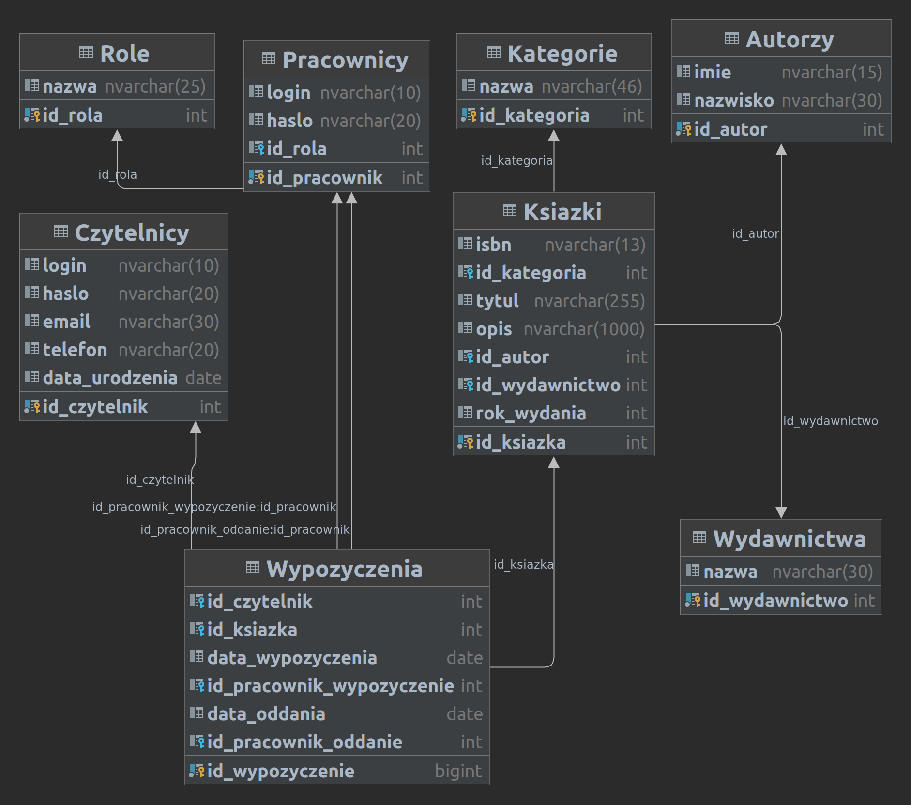

# Baza biblioteka 

Aby pobrać bazę biblioteka należy wejść w link [http://anonco.pl/contents/sql/training-databases/library/script.zip](http://anonco.pl/contents/sql/training-databases/library/script.zip)

I wykonać znaleziony tam skrypt.sql w SSMS

# Schemat bazy

